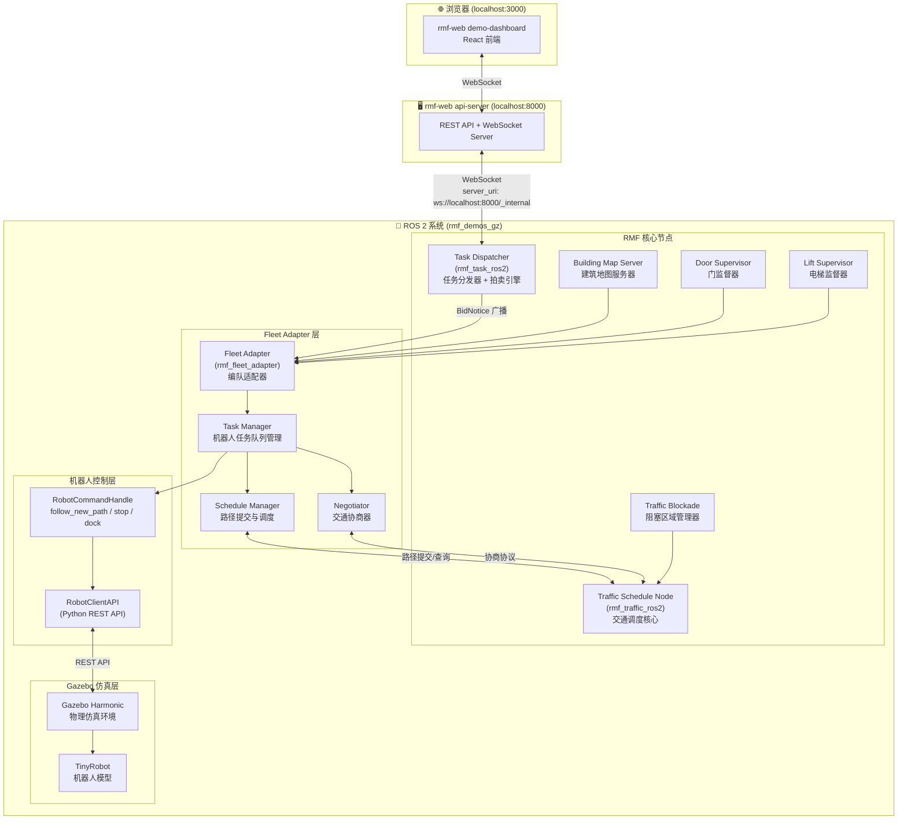
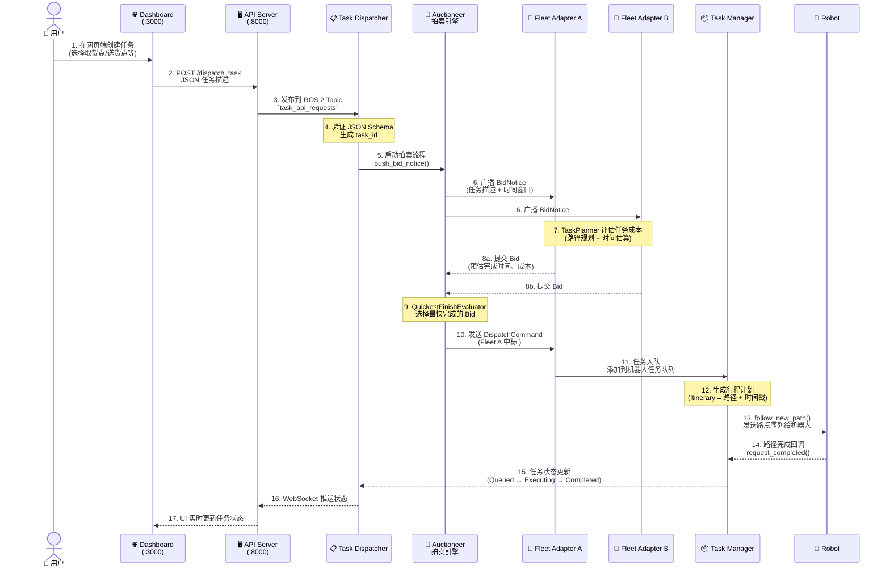
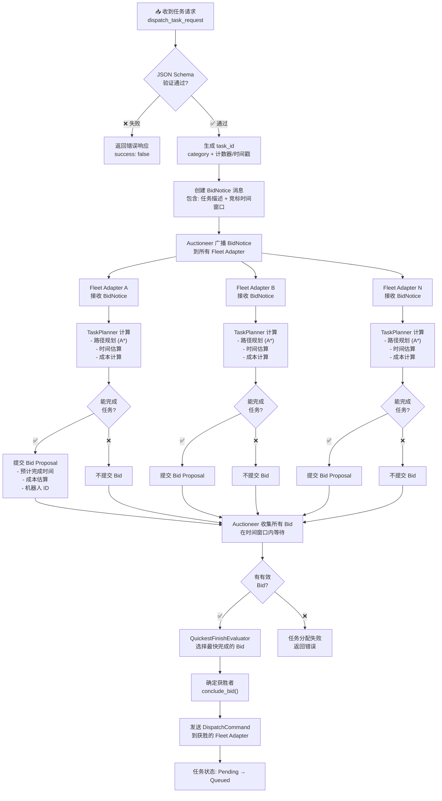
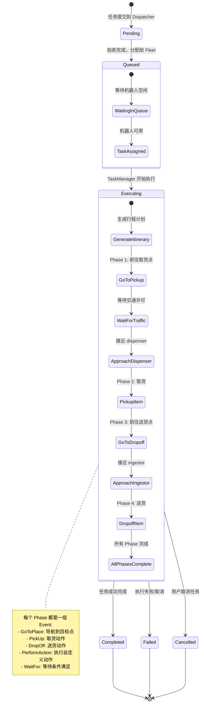
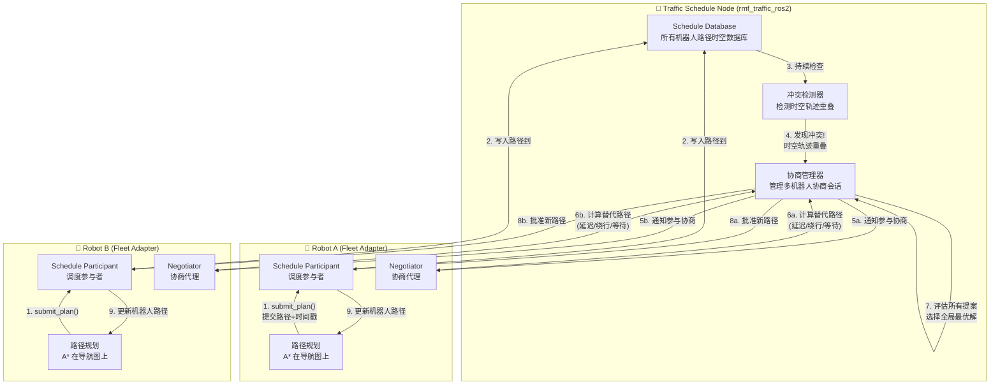
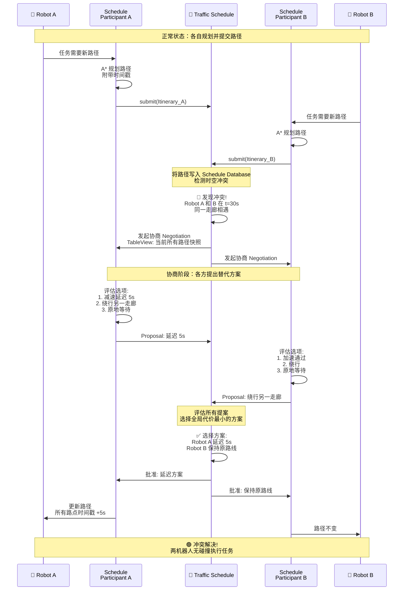
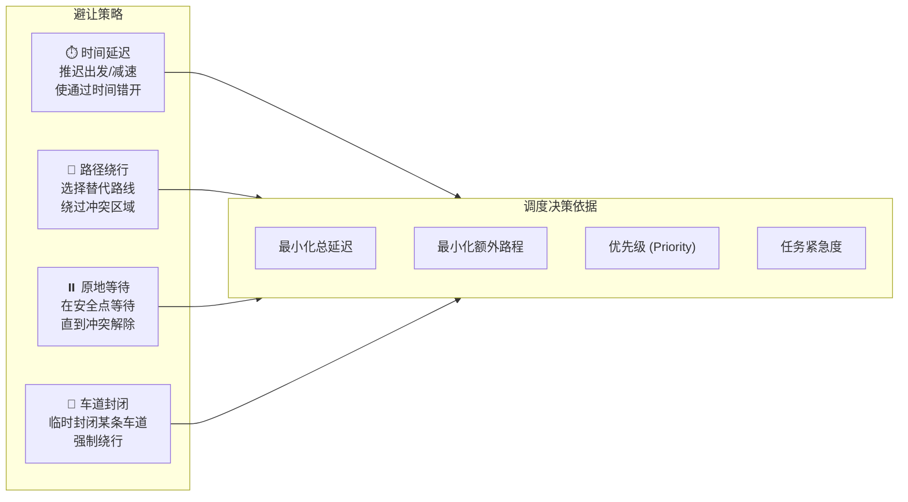
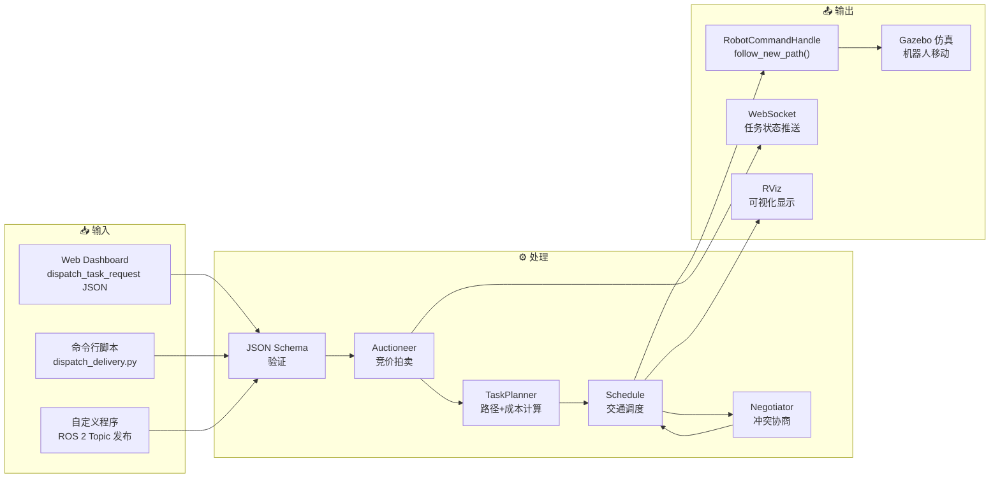
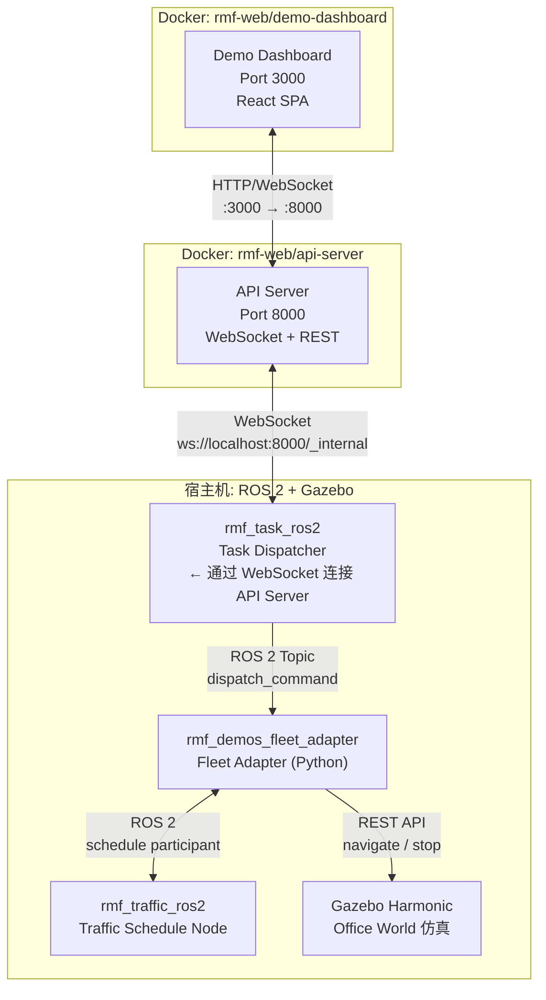
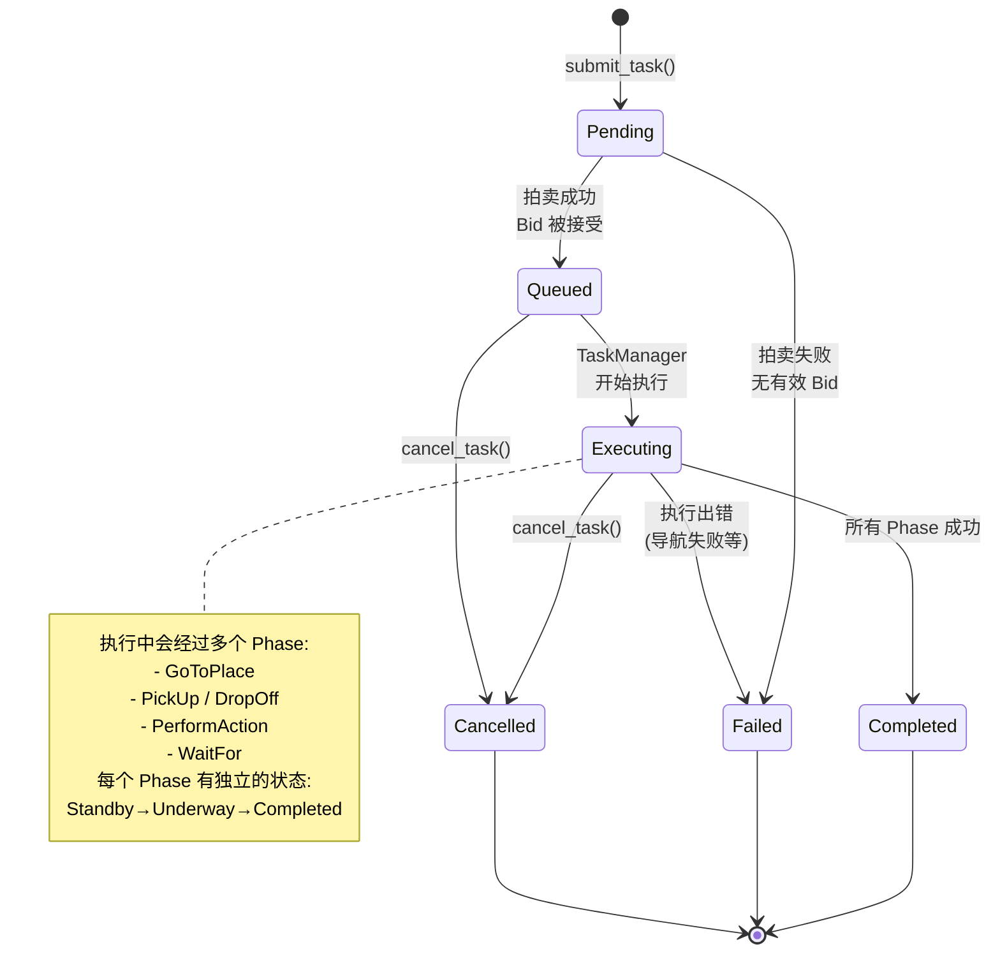

# Open-RMF 项目程序流程图

> 基于 `rmf_demos` office world 场景，展示从 Web 端创建任务到机器人执行、多机器人调度避让的完整流程。

---

## 1. 系统总体架构



---

## 2. 任务提交流程（Web → 机器人）



---

## 3. 拍卖竞价机制（Task Dispatching Bidding）



---

## 4. 机器人任务执行流程



---

## 5. 多机器人调度与避让机制（Traffic Negotiation）



### 5.1 交通协商详细流程



### 5.2 避让策略类型



---

## 6. 数据流全景图



---

## 7. 您的启动命令对应的节点拓扑

根据您的启动命令：

```bash
# 命令 1: API Server (Docker)
sudo docker run --rm -it --network host \
  ghcr.io/open-rmf/rmf-web/api-server:jazzy-nightly

# 命令 2: Dashboard (Docker)  
sudo docker run --rm -it --network host \
  ghcr.io/open-rmf/rmf-web/demo-dashboard:jazzy-nightly

# 命令 3: ROS 2 仿真系统
ros2 launch rmf_demos_gz office.launch.xml \
  server_uri:="ws://localhost:8000/_internal"
```



---

## 8. 关键 ROS 2 通信接口汇总

| 通信方式 | 接口名称 | 方向 | 说明 |
|---------|---------|------|------|
| **Topic** | `task_api_requests` | Web → Dispatcher | 接收任务请求 (JSON) |
| **Topic** | `task_api_responses` | Dispatcher → Web | 返回任务响应 |
| **Topic** | `dispatch_command` | Dispatcher → FleetAdapter | 分发任务命令 |
| **Topic** | `dispatch_ack` | FleetAdapter → Dispatcher | 任务确认 |
| **Topic** | `dispatch_states` | Dispatcher → 外部 | 任务状态广播 |
| **Topic** | `bid_notice` | Auctioneer → FleetAdapter | 竞标通知 |
| **Topic** | `bid_proposal` | FleetAdapter → Auctioneer | 竞标提案 |
| **Service** | `submit_task` | 外部 → Dispatcher | 旧版任务提交接口 |
| **Service** | `cancel_task` | 外部 → Dispatcher | 取消任务 |
| **WebSocket** | `ws://localhost:8000/_internal` | API Server ↔ Dispatcher | 双向实时通信 |

---

## 9. 任务状态机



---

## 总结

RMF 的任务流转核心可以概括为 **"提交 → 拍卖 → 分配 → 规划 → 协商 → 执行"** 六个阶段：

1. **提交**：用户在 Web Dashboard 创建任务，通过 API Server 转换为 ROS 2 消息
2. **拍卖**：Task Dispatcher 的 Auctioneer 向所有 Fleet Adapter 发起竞标，选择最快完成的机器人
3. **分配**：获胜的 Fleet Adapter 将任务加入对应机器人的任务队列
4. **规划**：TaskManager 将任务分解为 Phase/Event 序列，生成带时间戳的路径
5. **协商**：Traffic Schedule Node 检测多机器人路径冲突，通过 Negotiator 协商解决
6. **执行**：RobotCommandHandle 将路径发送给机器人（仿真/真实），机器人执行任务并回报状态
